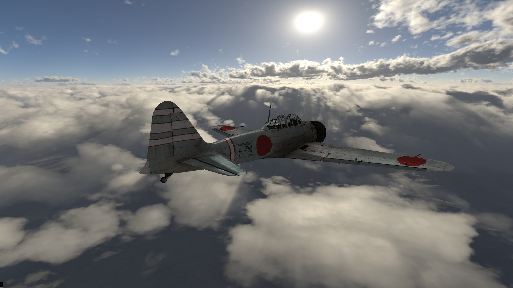

examples/test0
220fps 1080p (Intel i5-8250U 4cores 8threads)

examples/test1
Simple raycaster

Memory bound = main bottleneck.
Hierarchical rasterization significantly increases memory coherency.
This is a very good explanation of tiled rasterization:
	High-Performance Software Rasterization on GPUs (NVIDIA Research)
